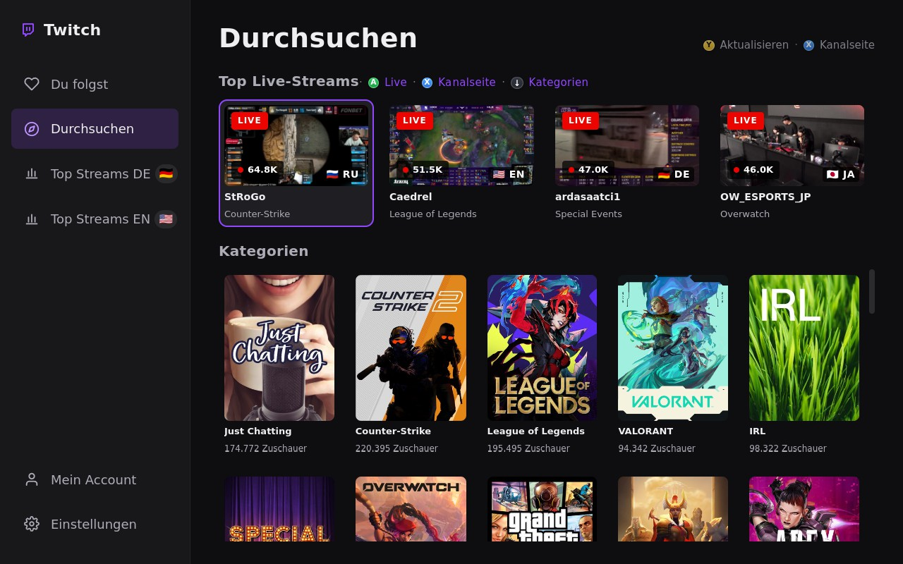
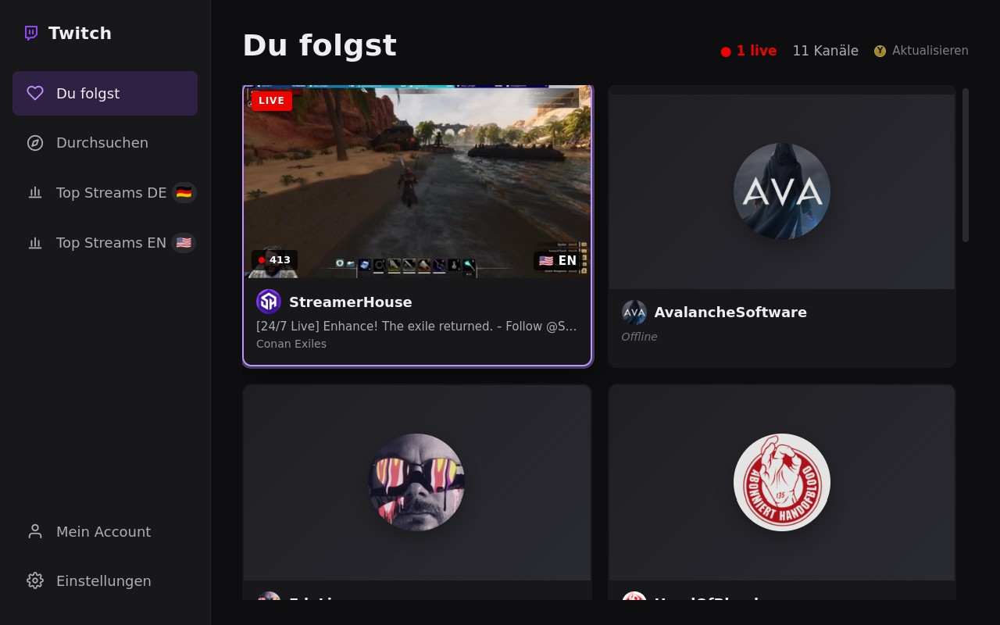
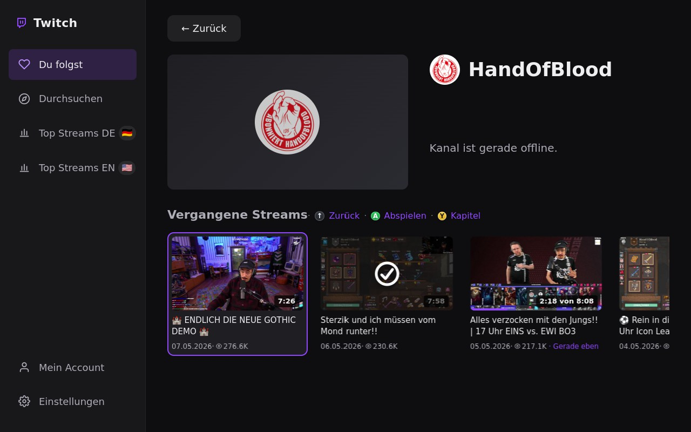
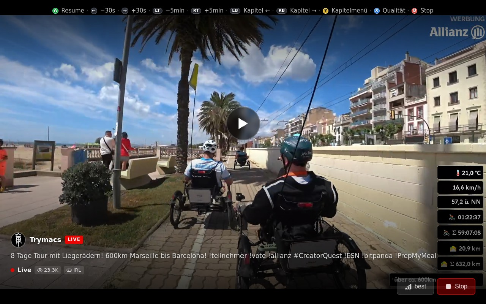
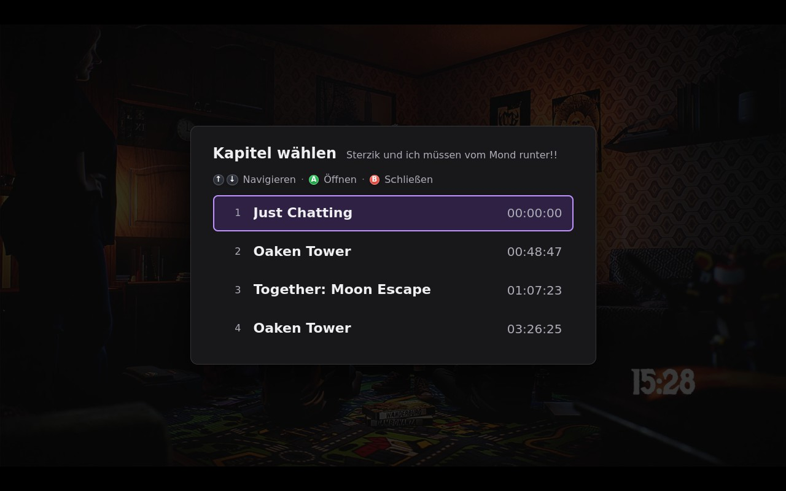

[English](#english) | [Deutsch](#deutsch)

---

<a name="english"></a>
# Twitch4SteamDeck

> **Disclaimer:** This app was vibe coded with Claude Code— architecture and structure were planned together with AI, and all implementation was done through prompts. Not a single line was written by hand.

Twitch client for the Steam Deck with Big-Screen UI, full gamepad control, and VOD playback with resume.

## Screenshots

<p align="center">
  
  
</p>
<p align="center">
  
  
</p>
<p align="center">
  
</p>

## Features

- **Live Streams** — Ad-free playback via Streamlink + hls.js (HTML5 video, no external player)
- **VOD Playback** — Watch recordings with automatic resume at last position
- **VOD Chapters** — Browse and jump to chapters within VODs; view count displayed on VOD cards
- **Video Quality Selection** — Change stream quality on-the-fly during playback (Live and VOD); available qualities fetched dynamically via Streamlink; session-only, defaults to `best`
- **Direct Stream Start** — Press A on any stream card in Browse/Top Streams/Category to start immediately without leaving the browse view
- **Gamepad Control** — Full control via Steam Deck controller, Xbox, or PlayStation gamepad (USB and Bluetooth), including Gaming Mode (reads Linux evdev `/dev/input/event*` directly with standardized BTN_* codes — works with any controller regardless of driver)
- **Big-Screen UI** — 10-foot interface optimized for TV/deck; fills the screen on Steam Deck and on external TVs when docked (React + Electron)
- **Twitch Login** — Device Code Flow with QR code (no browser required)
- **Following** — Live status and overview of followed streamers
- **Category Browser** — Browse Twitch categories and top streams
- **Language-Filtered Streams** — Top streams filtered by German/English
- **Account Screen** — User profile, app version, logout
- **VOD History** — Local SQLite database with playback history and progress
- **Hardware Decoding** — GPU-accelerated video via Chromium's built-in VA-API on Steam Deck
- **Quit Dialog** — Confirm quit via Xbox/Start button
- **Logout Confirmation** — Confirmation dialog before logging out

## Architecture

```
Electron (Main Process)
  ├── Auth          -- Twitch Device Code Flow + token management (Electron safeStorage)
  ├── Helix Client  -- Twitch API (followed channels, streams, VODs, categories, chapters via GQL)
  ├── Playback      -- Streamlink --stream-url → HLS URL → IPC event to renderer
  ├── Gamepad       -- Linux evdev (/dev/input/event*), discovered via js*, BTN_* codes
  └── History       -- SQLite (better-sqlite3) for VOD history + resume

Shared (src/shared/)
  └── Types         -- Shared types between main and renderer (PlaybackEvent, HlsUrlPayload, …)

Electron (Renderer)
  ├── React UI      -- Screens: Login, Following, Browse, Category, Channel,
  │                    StreamList (DE/EN), Settings, Account
  ├── VideoPlayer   -- hls.js <video> wrapper (forwardRef, imperative handle)
  ├── ChapterPanel  -- Chapter selection panel (during playback or VOD start)
  ├── QualityPanel  -- Quality selection panel
  └── AppShell      -- Global playback overlay for direct stream start
```

## Installation (Steam Deck)

```bash
flatpak install --user twitch4steamdeck.flatpak
flatpak run tv.twitch4steamdeck.App
```

Finished Flatpak bundles include everything (incl. Streamlink and Twitch integration) — no further setup required.

---

## Build yourself (developers)

### Prerequisites

- [Node.js](https://nodejs.org/) >= 20
- npm
- Windows: Streamlink installed at `%LOCALAPPDATA%\Programs\Streamlink\bin\streamlink.exe`
- For Flatpak build: WSL2 (Ubuntu) with `flatpak`, `flatpak-builder`, `librsvg2-bin`

### Setup

1. Clone the repository:
   ```bash
   git clone https://github.com/<user>/twitch4steamdeck.git
   cd twitch4steamdeck
   ```

2. Register your own Twitch app at https://dev.twitch.tv/console/apps:
   - **OAuth Redirect URLs:** `http://localhost`
   - **Client Type:** Public

3. Create `.env`:
   ```bash
   cp .env.example .env
   ```
   Enter the Client ID from step 2 into `.env`:
   ```
   MAIN_VITE_TWITCH_CLIENT_ID=your_client_id_here
   ```

   > The Client ID is embedded into the app at build time. End users installing a finished Flatpak do not need to register their own Twitch app.

4. Install dependencies:
   ```bash
   npm install
   ```

### Development

```bash
npm run dev
```

Starts Electron with Hot-Reload (electron-vite). Open DevTools with `Ctrl+Shift+I`.

## Build

### Desktop (AppImage)

```bash
npm run package
```

Creates a Linux AppImage under `dist/`.

### Flatpak (Steam Deck)

The Flatpak build must run in WSL2 on the Linux filesystem (not under `/mnt/`):

```bash
# Copy project to Linux filesystem
cp -rp /mnt/c/Projekte/twitch4steamdeck ~/twitch4steamdeck
cd ~/twitch4steamdeck

# Run full build (incl. streamlink, Electron)
bash flatpak/build-flatpak.sh
```

The script handles automatically:
1. Install Flatpak runtimes (freedesktop SDK 24.08, Electron2 BaseApp)
2. npm install + rebuild native modules (better-sqlite3 for Linux x64)
3. electron-vite build
4. Generate Streamlink Python deps
5. Run flatpak-builder
6. Create Flatpak bundle and transfer via SCP to Steam Deck

## Gamepad Layout

| Button | Context | Function |
|--------|---------|----------|
| A | Browse / Top Streams / Category | Start stream directly (full-screen overlay) |
| X | Browse / Top Streams / Category | Open channel page |
| A | Following | Open channel page |
| A | Channel page | Play live stream / confirm |
| A | During playback | Pause / Resume |
| X | During playback | Open quality selection panel |
| Y | During playback (VOD) | Open chapter menu |
| B | During playback | Stop |
| ← / → (D-Pad) | During playback | Seek ±30s |
| LT / RT | During playback (VOD) | Seek ±5min |
| LB / RB | During playback (VOD) | Previous / next chapter |
| B | Navigation | Back |
| D-Pad / Left Stick | Navigation | Navigate |
| LB / RB | Navigation | Switch tabs |
| Xbox / Start | Navigation | Quit dialog |

## Security

- **Twitch tokens** are stored encrypted in the OS keystore (Electron `safeStorage`) and never end up in the build or repository
- **Client ID** is a public identifier (Public App) and not a secret
- `.env`, `out/`, `dist/` and `userData/` are excluded in `.gitignore`

## Tech Stack

| Component | Technology |
|-----------|------------|
| Framework | Electron 33 + electron-vite |
| UI | React 18 + TypeScript |
| Video | hls.js 1.6 (HTML5 `<video>` in Renderer) |
| Stream URL | Streamlink 8.2.1 (Windows dev) / 6.11.0 (Flatpak) via `--stream-url` |
| Database | better-sqlite3 |
| Gamepad | Linux evdev (`/dev/input/event*`), Xbox / PS / any BT or USB controller |
| Packaging | Flatpak / electron-builder (AppImage) |
| HW Decoding | Chromium VA-API (automatic on Steam Deck) |

## License

---

<a name="deutsch"></a>
# Twitch4SteamDeck

> **Hinweis:** Diese App wurde mit Claude vibe coded — Architektur und Struktur wurden gemeinsam mit KI geplant, die gesamte Implementierung erfolgte per Prompt. Keine einzige Zeile wurde von Hand geschrieben.

 Twitch-Client fuer das Steam Deck mit Big-Screen-UI, voller Gamepad-Steuerung und VOD-Wiedergabe mit Resume.

## Features

- **Live-Streams** — Wiedergabe ueber Streamlink + hls.js (HTML5-Video, kein externer Player)
- **VOD-Wiedergabe** — Aufnahmen ansehen mit automatischem Resume an der letzten Position
- **VOD-Kapitel** — Kapitel in VODs durchsuchen und direkt anspringen; Aufrufzahl auf VOD-Karten
- **Video-Qualitaetswahl** — Stream-Qualitaet waehrend der Wiedergabe aendern (Live und VOD); verfuegbare Qualitaeten werden dynamisch ueber Streamlink ermittelt; nur Session-State, Standard ist `best`
- **Direkter Stream-Start** — A-Button auf einer Stream-Karte in Durchsuchen/Top-Streams/Kategorie startet den Stream sofort als Vollbild-Overlay, ohne die Browse-Ansicht zu verlassen
- **Gamepad-Steuerung** — Volle Bedienung per Steam Deck Controller, Xbox- oder PlayStation-Gamepad (USB und Bluetooth), auch im Gaming Mode (liest Linux evdev `/dev/input/event*` direkt mit standardisierten BTN_*-Codes — funktioniert mit jedem Controller unabhängig vom Treiber)
- **Big-Screen-UI** — 10-Foot-Interface optimiert fuer TV/Deck; bildschirmfuellend auf dem Steam Deck und auf externen TVs im Docking-Betrieb (React + Electron)
- **Twitch-Login** — Device Code Flow mit QR-Code (kein Browser noetig)
- **Gefolgte Kanaele** — Live-Status und Uebersicht der gefolgten Streamer
- **Kategorie-Browser** — Twitch-Kategorien und Top-Streams durchsuchen
- **Sprachgefilterte Streams** — Top-Streams gefiltert nach Deutsch/Englisch
- **Account-Ansicht** — Nutzerprofil, App-Version, Abmelden
- **VOD-Verlauf** — Lokale SQLite-Datenbank mit Wiedergabe-Historie und Fortschritt
- **Hardware-Decoding** — GPU-beschleunigte Videowiedergabe ueber Chromiums eingebaute VA-API auf dem Steam Deck
- **Quit-Dialog** — Beenden per Xbox/Start-Button bestaetigen
- **Logout-Bestaetigung** — Bestaedigungsdialog vor dem Abmelden

## Architektur

```
Electron (Main Process)
  ├── Auth          -- Twitch Device Code Flow + Token-Verwaltung (Electron safeStorage)
  ├── Helix Client  -- Twitch API (gefolgte Kanaele, Streams, VODs, Kategorien, Kapitel via GQL)
  ├── Playback      -- Streamlink --stream-url → HLS-URL → IPC-Event an Renderer
  ├── Gamepad       -- Linux evdev (/dev/input/event*), via js* erkannt, BTN_*-Codes
  └── History       -- SQLite (better-sqlite3) fuer VOD-Verlauf + Resume

Geteilt (src/shared/)
  └── Types         -- Geteilte Typen zwischen Main und Renderer (PlaybackEvent, HlsUrlPayload, …)

Electron (Renderer)
  ├── React UI      -- Screens: Login, Following, Browse, Category, Channel,
  │                    StreamList (DE/EN), Settings, Account
  ├── VideoPlayer   -- hls.js <video> Wrapper (forwardRef, imperative handle)
  ├── ChapterPanel  -- Kapitel-Auswahl-Panel (waehrend Wiedergabe oder VOD-Start)
  ├── QualityPanel  -- Qualitaets-Auswahl-Panel
  └── AppShell      -- Globaler Playback-Overlay fuer Direkt-Stream-Start
```

## Installation (Steam Deck)

```bash
flatpak install --user twitch4steamdeck.flatpak
flatpak run tv.twitch4steamdeck.App
```

Fertige Flatpak-Bundles enthalten alles (inkl. Streamlink und Twitch-Anbindung) -- keine weitere Einrichtung noetig.

---

## Selbst bauen (Entwickler)

### Voraussetzungen

- [Node.js](https://nodejs.org/) >= 20
- npm
- Windows: Streamlink unter `%LOCALAPPDATA%\Programs\Streamlink\bin\streamlink.exe`
- Fuer Flatpak-Build: WSL2 (Ubuntu) mit `flatpak`, `flatpak-builder`, `librsvg2-bin`

### Einrichtung

1. Repository klonen:
   ```bash
   git clone https://github.com/<user>/twitch4steamdeck.git
   cd twitch4steamdeck
   ```

2. Eigene Twitch-App registrieren auf https://dev.twitch.tv/console/apps:
   - **OAuth Redirect URLs:** `http://localhost`
   - **Client Type:** Public

3. `.env` anlegen:
   ```bash
   cp .env.example .env
   ```
   Die Client-ID aus Schritt 2 in `.env` eintragen:
   ```
   MAIN_VITE_TWITCH_CLIENT_ID=deine_client_id_hier
   ```

   > Die Client-ID wird beim Build in die App eingebettet. Endnutzer, die ein fertiges Flatpak installieren, brauchen keine eigene Twitch-App zu registrieren.

4. Abhaengigkeiten installieren:
   ```bash
   npm install
   ```

### Entwicklung

```bash
npm run dev
```

Startet Electron mit Hot-Reload (electron-vite). DevTools oeffnen mit `Ctrl+Shift+I`.

## Build

### Desktop (AppImage)

```bash
npm run package
```

Erzeugt ein Linux-AppImage unter `dist/`.

### Flatpak (Steam Deck)

Der Flatpak-Build muss in WSL2 auf dem Linux-Dateisystem ausgefuehrt werden (nicht unter `/mnt/`):

```bash
# Projekt auf Linux-Dateisystem kopieren
cp -rp /mnt/c/Projekte/twitch4steamdeck ~/twitch4steamdeck
cd ~/twitch4steamdeck

# Kompletten Build ausfuehren (inkl. Streamlink, Electron)
bash flatpak/build-flatpak.sh
```

Das Script erledigt automatisch:
1. Flatpak-Runtimes installieren (freedesktop SDK 24.08, Electron2 BaseApp)
2. npm install + native Module rebuilden (better-sqlite3 fuer Linux x64)
3. electron-vite Build
4. Streamlink Python-Deps generieren
5. flatpak-builder ausfuehren
6. Flatpak-Bundle erstellen und per SCP aufs Steam Deck uebertragen

## Gamepad-Belegung

| Taste | Kontext | Funktion |
|-------|---------|----------|
| A | Durchsuchen / Top-Streams / Kategorie | Stream direkt starten (Vollbild-Overlay) |
| X | Durchsuchen / Top-Streams / Kategorie | Kanalseite oeffnen |
| A | Du folgst | Kanalseite oeffnen |
| A | Kanalseite | Live-Stream starten / Bestaetigen |
| A | Waehrend Wiedergabe | Pause / Fortsetzen |
| X | Waehrend Wiedergabe | Qualitaetspanel oeffnen |
| Y | Waehrend Wiedergabe (VOD) | Kapitelmenü oeffnen |
| B | Waehrend Wiedergabe | Stop |
| ← / → (D-Pad) | Waehrend Wiedergabe | ±30s springen |
| LT / RT | Waehrend Wiedergabe (VOD) | ±5min springen |
| LB / RB | Waehrend Wiedergabe (VOD) | Vorheriges / naechstes Kapitel |
| B | Navigation | Zurueck |
| D-Pad / Left Stick | Navigation | Navigieren |
| LB / RB | Navigation | Tab wechseln |
| Xbox / Start | Navigation | Quit-Dialog |

## Sicherheit

- **Twitch-Tokens** werden verschluesselt im OS-Keystore gespeichert (Electron `safeStorage`) und landen weder im Build noch im Repository
- **Client-ID** ist eine oeffentliche Kennung (Public App) und kein Geheimnis
- `.env`, `out/`, `dist/` und `userData/` sind in `.gitignore` ausgeschlossen

## Tech-Stack

| Komponente | Technologie |
|-----------|-------------|
| Framework | Electron 33 + electron-vite |
| UI | React 18 + TypeScript |
| Video | hls.js 1.6 (HTML5 `<video>` im Renderer) |
| Stream-URL | Streamlink 8.2.1 (Windows-Dev) / 6.11.0 (Flatpak) via `--stream-url` |
| Datenbank | better-sqlite3 |
| Gamepad | Linux evdev (`/dev/input/event*`), Xbox / PS / beliebiger BT- oder USB-Controller |
| Packaging | Flatpak / electron-builder (AppImage) |
| HW-Decoding | Chromium VA-API (automatisch auf Steam Deck) |

## Lizenz
